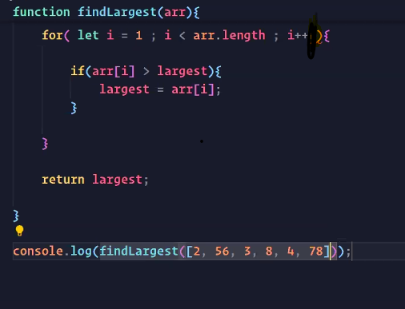

// https://find-saminravi99.notion.site/JS-Interview-Problem-Solving-Sheet-139c48b8ac8c801aa8d2dfc8e72c1c06

Day - 01 Workshop

JS Interview Problem Solving Sheet
1. Reverse a String
Problem:
Write a function that takes a string as input and returns the string reversed.
For example:
reverseString("hello");  // "olleh"

2. Palindrome Check
Problem:
Write a function that checks if a string is a palindrome.
A palindrome is a word that reads the same forward and backward.
For example:
isPalindrome("madam");  // true
isPalindrome("hello");  // false

//Solution:
function isPalindrome(str){
    let start = 0;
    let end = str.length - 1;

    while(start < end){
        if(str[start] !== str[end]){
            return false;
        }
        start++;
        end--;
    }
    return true;
}
console.log(isPalindrome("oogoo"));
console.log(isPalindrome("hello"));

3. Find the Largest Number in an Array
Problem:
Write a function that finds the largest number in an array.
For example:
findLargest([3, 1, 4, 1, 5, 9]);  // 9

4. Remove Duplicates from an Array
Problem:
Write a function that removes duplicate values from an array.
For example:
removeDuplicates([1, 2, 2, 3, 4, 4, 5]);  // [1, 2, 3, 4, 5]

function removeDuplicates(arr){
    let uniqueArr = [];

    for (let i = 0; i <= arr.length -1; i++){
        //console.log(arr[i]);
        let isDuplicate = false;

        for(let j =0; j <= uniqueArr.length - 1; j++){
            if(arr[i] === uniqueArr[j]){
                isDuplicate = true;
                break;
            }

        }
        if(!isDuplicate){
            uniqueArr.push(arr[i]);
        }
    }
    return uniqueArr;
}
console.log(removeDuplicates([1, 2, 2, 3, 4, 4, 5]));

5. Count Vowels in a String
Problem:
Write a function that counts the number of vowels (a, e, i, o, u) in a given string.
For example:
countVowels("hello");  // 2
countVowels("world");  // 1

function countVowels(str){
    let count = 0;
    const vowels = 'aeiouAEIOU';

    //"Hello"
    for(let i = 0; i < str,length; i++){
        //console.log(str[i]);
        if (vowels.indexOf(str[i]) !== -1){
            count++;
        }

    }
    return count;
}

6. Sum of Digits of a Number
Problem:
Write a function that calculates the sum of digits of a number.
For example:
sumOfDigits(1234);  // 10
sumOfDigits(567);   // 18

7. Find the Second Largest Number in an Array
Problem:
Write a function that finds the second largest number in an array.
For example:
findSecondLargest([3, 1, 4, 1, 5, 9]);  // 5

8. Factorial of a Number
Problem:
Write a function that calculates the factorial of a number.
The factorial of a number n is the product of all positive integers less than or equal to n.
For example:
factorial(5);  // 120
factorial(3);  // 6

9. FizzBuzz Problem
Problem:
Write a function that prints the numbers from 1 to n, but for multiples of 3, print "Fizz" instead of the number, and for multiples of 5, print "Buzz". For numbers which are multiples of both 3 and 5, print "FizzBuzz".
For example:
Input:
fizzBuzz(10);
//Output: 1, 2, Fizz, 4, Buzz, Fizz, 7, 8, Fizz, Buzz

function fizzBuzz(n){
    for (let i = 1; i <= n; i++){
        if(i % 3 == 0 && i % 5 == 0){
            console.log("FizzBuzz");
        }
        else if(i % 3 == 0 ){
            console.log("Fizz");
        }
        else if(i % 5 == 0){
            console.log("Buzz");
        }
        else{
            console.log(i);
        }
    }
}
console.log(FizzBuzz(15));

10. Count Occurrences of a Character in a String
Problem:
Write a function that takes a string and a character as input and returns the number of times the character appears in the string.
For example:

countCharacter("hello world", "o");  // 2
countCharacter("javascript", "a");   // 2
